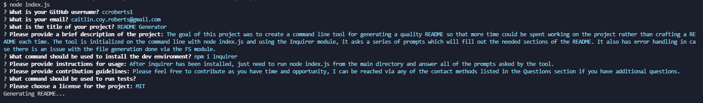

# README Generator


## Description

The goal of this project was to create a command line tool for generating a quality README so that more time could be spent working on the project rather than crafting a README each time. The tool is initialized on the command line with node index.js and using the Inquirer module, it asks a series of prompts which will fill out the needed sections of the README. It also has error handling in case there is an issue with the file generation done via the FS module.



## Table of Contents

- [Installation](#installation)
- [Usage](#usage)
- [License](#license)
- [How to Contribute](#contributing)
- [Tests](#tests)

## Installation

To install necessary dependencies, use the following command:

```
npm i inquirer
```

## Usage

After inquirer has been installed, just need to run node index.js from the main directory and answer all of the prompts asked by the tool.

## License

[MIT](https://choosealicense.com/licenses/mit/)

## Contributing

Please feel free to contribute as you have time and opportunity, I can be reached via any of the contact methods listed in the Questions section if you have additional questions.

## Questions

If you have any questions, please open an issue or reach out to me via email at <caitlin.coy.roberts@gmail.com>. You can find more of my work at [ccroberts1](https://github.com/ccroberts1)
